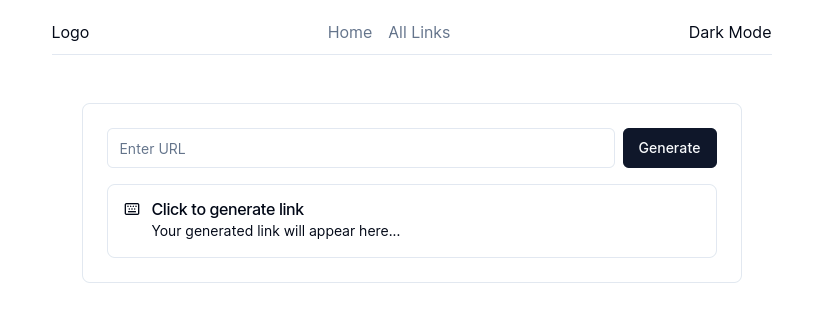

<h1 align="center">Url Shortener</h1>
<p align="center">An open source url shortener</p>
<p align="center">
    <a href="https://hasibur.tech" style="margin-right:1rem; text-decoration: underline;">Live Link</a>
    <a href="https://github.com/hasiburdev/url-shortener" style="margin-right:1rem; text-decoration: underline;">GitHub</a>
    <a href="https://github.com/hasiburdev/url-shortener/issues" style="text-decoration: underline">Issues</a>
</p>

<p align="center">
    <a href="https://github.com/hasiburdev/url-shortener/stargazers">
        
    </a>  
    <a href="https://github.com/hasiburdev/url-shortener/pulse">
        
    </a>
</p>

## About the Project

<p align="center">

</p>
This is an open source url shortening project for your day to day use built with Next.js, TailwindCSS, Shadcn/ui.

### You can ->

- Generate short links from any urls
- View all the generated urls
- View the visit counts of urls
- Edit/Delete your urls

### What's currently unavailable ->

- You can not share generated short links (It's currently storing the data in browser localStorage)
- Your can not open link in another browser in your same computer (Because of localStorage)

### What's in the future plan ->

- A short analyitcs of the visit counts, total generated links and similar stats in home page
- Url sharing feature (Need to implement backend for this)
- A browser extension (Yes! And I will definitely make it!)
- Setup monorepo for code reusablility (interfaces, types, utility functions, ui components for browser extension and web application)

## Getting Started

To run this project on your local machine, follow the instructions.
You will need to have `git`, `node`, `npm` or any node package manager (`yarn` or `pnpm`) installed on your local computer. (I personally love `pnpm`)

First, clone the repository:

```bash
git clone https://github.com/hasiburdev/url-shortener.git
```

Goto the project folder:

```bash
cd url-shortener
```

Install the dependencies:

```bash
npm i
#or
yarn
#or
pnpm i
```

Now, you can run the development server:

```bash
npm run dev
# or
yarn dev
# or
pnpm dev
```

Open [http://localhost:3000](http://localhost:3000) with your browser to see the result.

### Repo Activity


## Deployment

This project is deployed using [Vercel](https://vercel.com) and the domain is registered from [get.tech](https://get.tech). I got this free from [GitHub Student Pack](https://education.github.com/)

## Some extra notes

I started this project for the task given for Mock Interview Series by **Foyzul Karim** _[GitHub](https://github.com/foyzulkarim) [Facebook](https://www.facebook.com/foyzulsacademy) [Youtube]()_ vai and **Learn With Sumit** _[GitHub](https://github.com/learnwithsumit) [Facebook](https://www.facebook.com/LetsLearnwithSumit/) [Youtube](https://www.youtube.com/c/learnwithsumit). Task details can be found [here](https://github.com/foyzulkarim/mock-interviews-2023/blob/main/01-junior-react-dev.md) I plan to make this project feature rich gradually.
